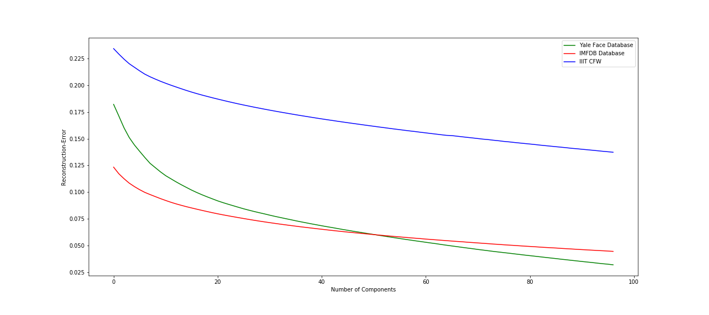
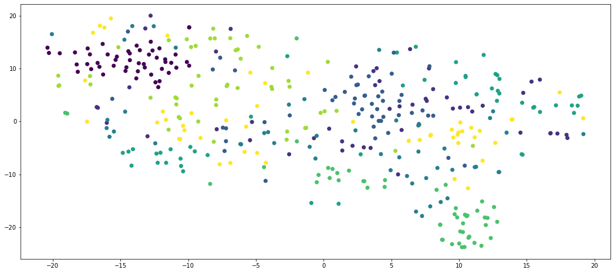
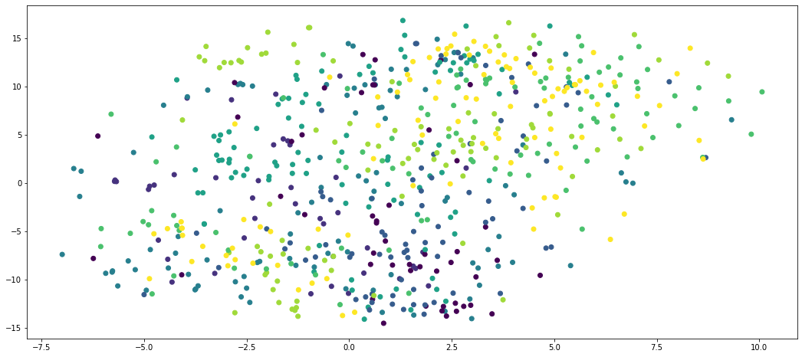
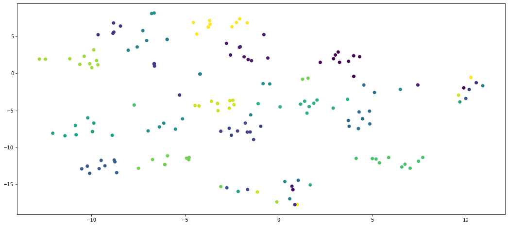

<p align="center">
  <h1 align="center">Face Classification and Verification</h1>
</p>

## Introduction
The main goal of this assignment is to familiarize with the proble of Classification of "faces" by using various famous feature extraction and classification methods.

## File Structure
The file structure of the repository is as follows:
```bash
.
├── 20171114.ipynb
├── 20171114_Report.pdf
├── README.md
├── SMAI_M_2019_A2_Final.pdf
├── assets
└── dataset

2 directories, 4 files
```
## :file_folder: Files
### 20171114.ipynb
- This is the ipython notebook containing all the necessary code in **python-3.5**.

### 20171114_Report.pdf
- A report of the various observations and experiments related to the assignment.

### dataset
- This folder contains 3 different kinds of datasets. Each dataset has faces images of humans. The datasets are:
	- **Yale Face Dataset**:
		- Contains face images of 15 subjects.
		- Each subject has 11 images with different emotions.
		- An **emotion.txt** is also present, which contains the mapping of emotions for each image.
	- **Indian Movie Face Database**:
		- Contains face images of 8 Indian movie actors.
		- There are 50 images for each actor.
	- **IIIT Cartoon Face Dataset**:
		- Contains cartoon faces of 8 subjects.
		- 100 images of each subject.

## :runner: Usage
- You can view the python-notebook using [nbviewer](https://nbviewer.jupyter.org/) or [Google Colab](https://colab.research.google.com/).
- Use jupyter to run the python-notebook locally.
```bash
pip install jupyter
jupyter 20171114.ipynb
```

## Summary of Results
There are 5 compoments of the assignments, results of which are summarised below:
### Understanding **Eigen Faces**
#### What are eigen faces?
Eigen Faces are the set of eigen-vectors of the covariance-matrix of face images that are used in the problem of human face recognition.

#### How many eigen vectors/faces are required to reconstruct a person in the three datasets?
Eigen-Value Spectrum for the datasets


- We use the following equation to calculate the number of eigen-vectors () with reasonable accuracy .

<p align="center">
	
</p>

where  and  is the set of selected eigen-vectors and  is the set of all eigen-vectors.

### Trying the various combinations of feature-extractions and classifiers.
#### Indian Movie Face Database

| Index | Feature | Reduced Dimensional Space | Classification Error | Accuracy | F1-Score | Precision |
| :---: | :---: | :---: | :---: | :---: | :---: | :---: |
| 1 | PCA with MLP | 55 | 0.100 | 0.900 | 0.900 | 0.900 |
| 2 | PCA with SVM | 55 | 0.150 | 0.850 | 0.850 | 0.850 |
| 3 | PCA with LOGISTIC | 55 | 0.150 | 0.850 | 0.850 | 0.850 |
| 4 | PCA with KNN | 55 | 0.350 | 0.650 | 0.650 | 0.650 |
| 5 | Kernel-PCA with MLP | 55 | 0.525 | 0.475 | 0.475 | 0.475 |
| 6 | Kernel-PCA with SVM | 55 | 0.700 | 0.300 | 0.300 | 0.300 |
| 7 | Kernel-PCA with LOGISTIC | 55 | 0.500 | 0.500 | 0.500 | 0.500 |
| 8 | Kernel-PCA with KNN | 55 | 0.350 | 0.650 | 0.650 | 0.650 |
| 9 | LDA with MLP | 7 | 0.225 | 0.775 | 0.775 | 0.775 |
| 10 | LDA with SVM | 7 | 0.175 | 0.825 | 0.825 | 0.825 |
| 11 | LDA with LOGISTIC | 7 | 0.175 | 0.825| 0.825| 0825 |
| 12 | LDA with KNN | 7 | 0.125 | 0.875| 0.875| 0875 |
| 13 | Kernel-LDA with MLP | 7 | 0.250 | 0.750 | 0.750 | 0.750 |
| 14 | Kernel-LDA with SVM | 7 | 0.175 | 0.825 | 0.825 | 0.825 |
| 15 | Kernel-LDA with LOGISTIC | 7 | 0.175 | 0.825 | 0.825 | 0.825 |
| 16 | Kernel-LDA with KNN | 7 | 0.125 | 0.875 | 0.875 | 0.875 |
| 17 | VGG with MLP | 4096 | 0.100 | 0.900 | 0.900 | 0.900 |
| 18 | VGG with SVM | 4096 | 0.100 | 0.900 | 0.900 |0.900 |
| 19 | VGG with LOGISTIC | 4096 | 0.100 | 0.900 | 0.900 | 0.900 |
| 21 | VGG with KNN | 4096 | 0.125 | 0.875 | 0.875 | 0.875 |
| 22 | RESNET with MLP | 4096 | 0.025 | 0.975 | 0.975 | 0.975 |
| 23 | RESNET with SVM | 4096 | 0.050 | 0.950 | 0.950 | 0.950 |
| 24 | RESNET with LOGISTIC | 4096 | 0.025 | 0.975 | 0.975 | 0.975 |
| 25 | RESNET with KNN | 4096 | 0.075 | 0.925 | 0.925 | 0.925 |

#### IIIT Cartoon Face Dataset

| Index | Feature | Reduced Dimensional Space | Classification Error | Accuracy | F1-Score | Precision |
| :---: | :---: | :---: | :---: | :---: | :---: | :---: |
| 1 | PCA with MLP | 55 | 0.485294 | 0.514706 | 0.514706 | 0.514706 |
| 2 | PCA with SVM | 55 | 0.455882 | 0.544118 | 0.544118 | 0.544118 |
| 3 | PCA with LOGISTIC | 55 | 0.411765 | 0.588235 | 0.588235 | 0.588235 |
| 4 | PCA with KNN | 55 | 0.558824 | 0.441176 | 0.441176 | 0.441176 |
| 5 | Kernel-PCA with MLP | 55 | 0.573529 | 0.426471 | 0.426471 | 0.426471 |
| 6 | Kernel-PCA with SVM | 55 | 0.573529 | 0.426471 | 0.426471 | 0.426471 |
| 7 | Kernel-PCA with LOGISTIC | 55 | 0.544118 | 0.455882 | 0.455882 |0.455882 |
| 8 | Kernel-PCA with KNN | 55 | 0.514706 | 0.485294 | 0.485294 | 0.485294 |
| 9 | LDA with MLP | 7 | 0.676471 | 0.323529 | 0.323529 | 0.323529 |
| 10 | LDA with SVM | 7 | 0.602941 | 0.397059 | 0.397059 | 0.397059 |
| 11 | LDA with LOGISTIC | 7 | 0.617647 | 0.382353 | 0.382353 | 0.382353 |
| 12 | LDA with KNN | 7 | 0.735294 | 0.264706| 0.264706| 0.264706 |
| 13 | Kernel-LDA with MLP | 7 | 0.661765 | 0.338235 | 0.338235 | 0.338235 |
| 14 | Kernel-LDA with SVM | 7 | 0.602941 | 0.397059 | 0.397059 | 0.397059 |
| 15 | Kernel-LDA with LOGISTIC | 7 | 0.617647 | 0.825 | 0.825 | 0.825 |
| 16 | Kernel-LDA with KNN | 7 | 0.735294 | 0.264706 | 0.264706 | 0.264706 |
| 17 | VGG with MLP | 4096 | 0.382353 | 0.617647  | 0.617647 | 0.617647 |
| 18 | VGG with SVM | 4096 | 0.323529 | 0.676471 | 0.676471 | 0.676471 |
| 19 | VGG with LOGISTIC | 4096 | 0.323529 | 0.676471 | 0.676471 | 0.676471 |
| 20 | VGG with KNN | 4096 | 0.441176 | 0.558824 | 0.558824 | 0.558824 |
| 21 | RESNET with MLP | 4096 | 0.014706 | 0.985294 | 0.985294 | 0.985294 |
| 22 | RESNET with SVM | 4096 | 0.014706 | 0.985294 | 0.985294 | 0.985294 |
| 23 | RESNET with LOGISTIC | 4096 | 0.014706 | 0.985294 | 0.985294 | 0.985294 |
| 24 | RESNET with KNN | 4096 | 0.000000 | 1.000000 | 1.000000 | 1.000000 |

#### Yale Face Dataset


| Index | Feature | Reduced Dimensional Space | Classification Error | Accuracy | F1-Score | Precision |
| :---: | :---: | :---: | :---: | :---: | :---: | :---: |
| 1 | PCA with MLP | 55 | 0.485294 | 0.514706 | 0.514706 | 0.514706 |
| 2 | PCA with SVM | 55 | 0.455882 | 0.544118 | 0.544118 | 0.544118 |
| 3 | PCA with LOGISTIC | 55 | 0.411765 | 0.588235 | 0.588235 | 0.588235 |
| 4 | PCA with KNN | 55 | 0.558824 | 0.441176 | 0.441176 | 0.441176 |
| 5 | Kernel-PCA with MLP | 55 | 0.573529 | 0.426471 | 0.426471 | 0.426471 |
| 6 | Kernel-PCA with SVM | 55 | 0.573529 | 0.426471 | 0.426471 | 0.426471 |
| 7 | Kernel-PCA with LOGISTIC | 55 | 0.544118 | 0.455882 | 0.455882 |0.455882 |
| 8 | Kernel-PCA with KNN | 55 | 0.514706 | 0.485294 | 0.485294 | 0.485294 |
| 9 | LDA with MLP | 7 | 0.676471 | 0.323529 | 0.323529 | 0.323529 |
| 10 | LDA with SVM | 7 | 0.602941 | 0.397059 | 0.397059 | 0.397059 |
| 11 | LDA with LOGISTIC | 7 | 0.617647 | 0.382353 | 0.382353 | 0.382353 |
| 12 | LDA with KNN | 7 | 0.735294 | 0.264706| 0.264706| 0.264706 |
| 13 | Kernel-LDA with MLP | 7 | 0.661765 | 0.338235 | 0.338235 | 0.338235 |
| 14 | Kernel-LDA with SVM | 7 | 0.602941 | 0.397059 | 0.397059 | 0.397059 |
| 15 | Kernel-LDA with LOGISTIC | 7 | 0.617647 | 0.825 | 0.825 | 0.825 |
| 16 | Kernel-LDA with KNN | 7 | 0.735294 | 0.264706 | 0.264706 | 0.264706 |
| 17 | VGG with MLP | 4096 | 0.382353 | 0.617647  | 0.617647 | 0.617647 |
| 18 | VGG with SVM | 4096 | 0.323529 | 0.676471 | 0.676471 | 0.676471 |
| 19 | VGG with LOGISTIC | 4096 | 0.323529 | 0.676471 | 0.676471 | 0.676471 |
| 20 | VGG with KNN | 4096 | 0.441176 | 0.558824 | 0.558824 | 0.558824 |
| 21 | RESNET with MLP | 4096 | 0.014706 | 0.985294 | 0.985294 | 0.985294 |
| 22 | RESNET with SVM | 4096 | 0.014706 | 0.985294 | 0.985294 | 0.985294 |
| 23 | RESNET with LOGISTIC | 4096 | 0.014706 | 0.985294 | 0.985294 | 0.985294 |
| 24 | RESNET with KNN | 4096 | 0.000000 | 1.000000 | 1.000000 | 1.000000 |


### t-SNE Based Visualiation of the datasets.

Indian Movie Face Database


IIIT Cartoon Face Dataset


Yale Face Dataset


### Gender Classification using a combination of IIIT-CFW and IMFDB datasets.
Took a combination of IIIT-CFW and IMFDB datasets and tried to classify the face as male/female.Basically, the problem is a binary classification problem of Gender Determination.

- Results of the various experiments are mentioned in the [Report](./20171114_Report.pdfs)

